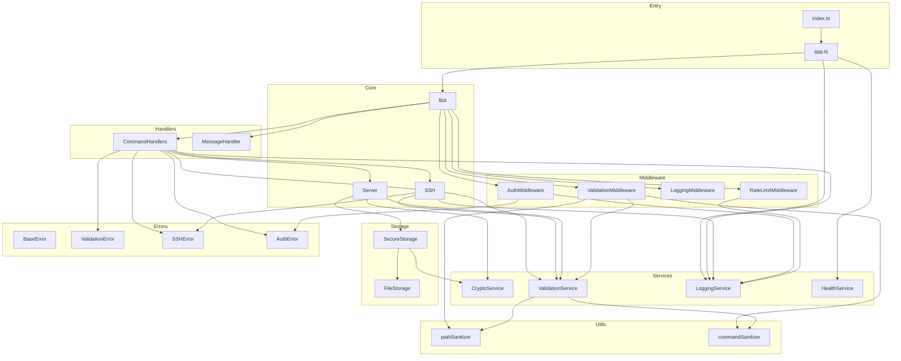
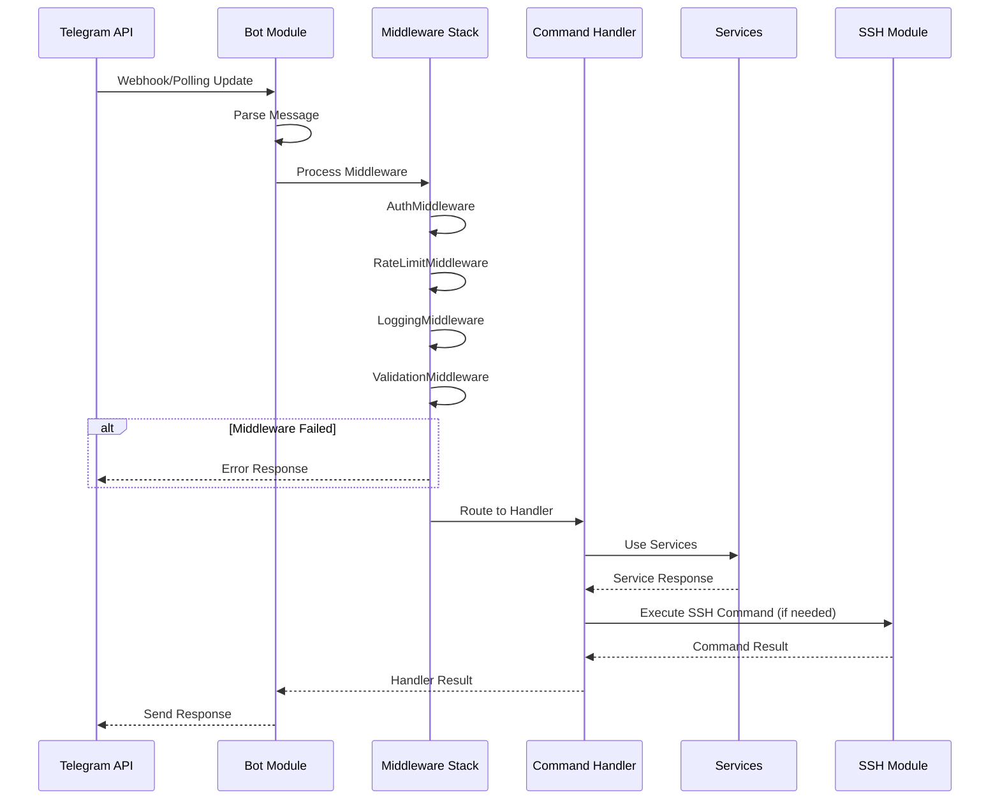
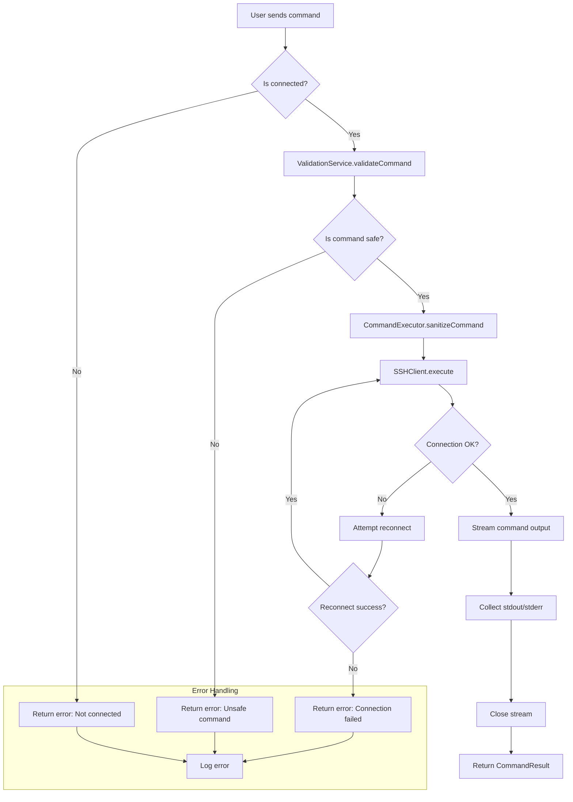
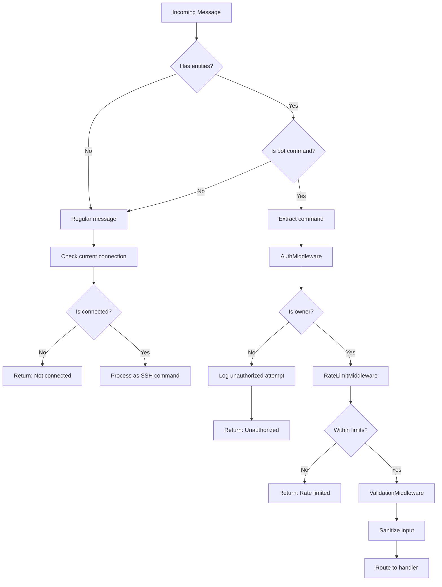

# Telegram-SSH Bot Architecture Design

## Executive Summary

This document outlines a comprehensive modular architecture for the Telegram-SSH bot, addressing the critical issues identified in the technical audit. The design prioritizes security, maintainability, and scalability while preparing for a TypeScript migration.

---

## Table of Contents

1. [Current State Analysis](#current-state-analysis)
2. [Project Structure](#project-structure)
3. [Module Design](#module-design)
4. [Type Definitions](#type-definitions)
5. [Data Flow Diagrams](#data-flow-diagrams)
6. [Security Architecture](#security-architecture)
7. [Error Handling Strategy](#error-handling-strategy)
8. [Configuration Schema](#configuration-schema)
9. [Migration Path](#migration-path)

---

## Current State Analysis

### Identified Issues

| Category     | Issue                                             | Severity | Location                                                 |
| ------------ | ------------------------------------------------- | -------- | -------------------------------------------------------- |
| Security     | Command injection via `/cmd`                      | Critical | [`bot.js:175`](bot.js:175)                               |
| Security     | SSH command injection                             | Critical | [`bot.js:83-85`](bot.js:83)                              |
| Security     | Path traversal in private key path                | High     | [`bot.js:307-318`](bot.js:307)                           |
| Security     | Plain text credential storage                     | High     | [`bot.js:356`](bot.js:356)                               |
| Bug          | `parseFloat()` instead of `parseInt()`            | High     | [`bot.js:379`](bot.js:379), [`bot.js:419`](bot.js:419)   |
| Bug          | Property name mismatch `keyPassword` vs `keypass` | High     | [`bot.js:349`](bot.js:349) vs [`bot.js:443`](bot.js:443) |
| Architecture | God Object pattern                                | High     | [`bot.js`](bot.js) - 496 lines                           |
| Architecture | Global mutable state                              | High     | Lines 58-76                                              |
| Performance  | Synchronous file I/O                              | Medium   | Throughout                                               |
| Performance  | No connection pooling                             | Medium   | SSH connections                                          |
| Performance  | Event listener accumulation                       | Medium   | SSH stream events                                        |

---

## Project Structure

### Directory Layout

```
telegram-ssh/
├── src/
│   ├── index.ts                    # Application entry point
│   ├── app.ts                      # Application bootstrap
│   │
│   ├── config/
│   │   ├── index.ts                # Config aggregator
│   │   ├── schema.ts               # Configuration validation schema
│   │   └── types.ts                # Configuration type definitions
│   │
│   ├── core/
│   │   ├── bot/
│   │   │   ├── index.ts            # Bot module exports
│   │   │   ├── TelegramBot.ts      # Telegram bot wrapper
│   │   │   ├── CommandRegistry.ts  # Command registration
│   │   │   └── MiddlewareStack.ts  # Middleware pipeline
│   │   │
│   │   ├── ssh/
│   │   │   ├── index.ts            # SSH module exports
│   │   │   ├── SSHClient.ts        # SSH client wrapper
│   │   │   ├── ConnectionPool.ts   # Connection pooling
│   │   │   └── CommandExecutor.ts  # Safe command execution
│   │   │
│   │   └── server/
│   │       ├── index.ts            # Server module exports
│   │       ├── ServerManager.ts    # Server CRUD operations
│   │       └── ServerRepository.ts # Data persistence
│   │
│   ├── handlers/
│   │   ├── index.ts                # Handler exports
│   │   ├── CommandHandler.ts       # Base command handler
│   │   ├── commands/
│   │   │   ├── AddCommand.ts       # /add handler
│   │   │   ├── ListCommand.ts      # /list handler
│   │   │   ├── RemoveCommand.ts    # /rm handler
│   │   │   ├── SSHCommand.ts       # /ssh handler
│   │   │   ├── ExitCommand.ts      # /exit handler
│   │   │   ├── CurrentCommand.ts   # /current handler
│   │   │   └── LocalCommand.ts     # /cmd handler (deprecated/secured)
│   │   │
│   │   └── MessageHandler.ts       # Non-command message handler
│   │
│   ├── middleware/
│   │   ├── index.ts                # Middleware exports
│   │   ├── AuthMiddleware.ts       # Owner authorization
│   │   ├── RateLimitMiddleware.ts  # Rate limiting
│   │   ├── LoggingMiddleware.ts    # Request logging
│   │   └── ValidationMiddleware.ts # Input validation
│   │
│   ├── services/
│   │   ├── index.ts                # Service exports
│   │   ├── CryptoService.ts        # Credential encryption
│   │   ├── ValidationService.ts    # Input validation
│   │   ├── LoggingService.ts       # Structured logging
│   │   └── HealthService.ts        # Health check endpoints
│   │
│   ├── storage/
│   │   ├── index.ts                # Storage exports
│   │   ├── FileStorage.ts          # File-based storage
│   │   └── SecureStorage.ts        # Encrypted storage wrapper
│   │
│   ├── types/
│   │   ├── index.ts                # Type exports
│   │   ├── server.types.ts         # Server-related types
│   │   ├── ssh.types.ts            # SSH-related types
│   │   ├── bot.types.ts            # Bot-related types
│   │   ├── config.types.ts         # Configuration types
│   │   └── errors.types.ts         # Error types
│   │
│   ├── utils/
│   │   ├── index.ts                # Utility exports
│   │   ├── pathSanitizer.ts        # Path traversal prevention
│   │   ├── commandSanitizer.ts     # Command injection prevention
│   │   ├── asyncUtils.ts           # Async helpers
│   │   └── retryUtils.ts           # Retry logic
│   │
│   └── errors/
│       ├── index.ts                # Error exports
│       ├── BaseError.ts            # Base error class
│       ├── ValidationError.ts      # Validation errors
│       ├── SSHError.ts             # SSH-related errors
│       ├── AuthError.ts            # Authentication errors
│       └── ConfigurationError.ts   # Configuration errors
│
├── tests/
│   ├── unit/                       # Unit tests
│   ├── integration/                # Integration tests
│   └── e2e/                        # End-to-end tests
│
├── docs/
│   ├── ARCHITECTURE.md             # This document
│   ├── API.md                      # API documentation
│   └── DEPLOYMENT.md               # Deployment guide
│
├── .env.example                    # Environment template
├── .env.schema.json                # Environment validation schema
├── tsconfig.json                   # TypeScript configuration
├── package.json
└── README.md
```

### File Naming Conventions

| Type                | Convention             | Example             |
| ------------------- | ---------------------- | ------------------- |
| Class files         | PascalCase             | `SSHClient.ts`      |
| Interface files     | PascalCase with .types | `server.types.ts`   |
| Utility files       | camelCase              | `pathSanitizer.ts`  |
| Test files          | PascalCase with .spec  | `SSHClient.spec.ts` |
| Configuration files | kebab-case             | `tsconfig.json`     |

---

## Module Design

### Core Modules

#### 1. Bot Module

**Responsibility:** Telegram bot lifecycle management and command routing.

```typescript
// Core interfaces
interface IBot {
  start(): Promise<void>;
  stop(): Promise<void>;
  registerCommand(command: ICommand): void;
  sendMessage(
    chatId: string,
    message: string,
    options?: MessageOptions,
  ): Promise<void>;
}

interface ICommandRegistry {
  register(command: ICommand): void;
  getHandler(commandName: string): ICommandHandler | undefined;
  getAllCommands(): BotCommand[];
}

interface IMiddlewareStack {
  use(middleware: IMiddleware): void;
  execute(context: MessageContext): Promise<void>;
}
```

**Dependencies:**

- `node-telegram-bot-api`
- Internal: `ICommandRegistry`, `IMiddlewareStack`

#### 2. SSH Module

**Responsibility:** SSH connection management and secure command execution.

```typescript
interface ISSHClient {
  connect(config: SSHConnectionConfig): Promise<void>;
  disconnect(): Promise<void>;
  isConnected(): boolean;
  execute(command: string): Promise<CommandResult>;
}

interface IConnectionPool {
  acquire(serverId: string): Promise<ISSHClient>;
  release(serverId: string): void;
  getActiveConnections(): string[];
  closeAll(): Promise<void>;
}

interface ICommandExecutor {
  execute(client: ISSHClient, command: string): Promise<CommandResult>;
  sanitizeCommand(command: string): SanitizedCommand;
}
```

**Dependencies:**

- `ssh2`
- Internal: `ICommandExecutor`, `IValidationService`

#### 3. Server Module

**Responsibility:** Server configuration CRUD operations and persistence.

```typescript
interface IServerManager {
  add(config: ServerConfig): Promise<Server>;
  remove(id: string): Promise<void>;
  list(): Promise<Server[]>;
  get(id: string): Promise<Server | null>;
  getByIndex(index: number): Promise<Server | null>;
  getCurrent(): Server | null;
  setCurrent(server: Server): void;
}

interface IServerRepository {
  save(servers: Server[]): Promise<void>;
  load(): Promise<Server[]>;
  validate(data: unknown): ServerConfig | null;
}
```

**Dependencies:**

- Internal: `ISecureStorage`, `IValidationService`

### Handler Modules

#### Command Handlers

```typescript
interface ICommandHandler {
  name: string;
  description: string;
  pattern: RegExp;
  execute(context: CommandContext): Promise<void>;
}

// Base implementation
abstract class BaseCommandHandler implements ICommandHandler {
  constructor(
    protected readonly serverManager: IServerManager,
    protected readonly logger: ILoggingService,
  ) {}

  abstract execute(context: CommandContext): Promise<void>;
}
```

### Service Modules

#### 1. Crypto Service

```typescript
interface ICryptoService {
  encrypt(plaintext: string): Promise<EncryptedData>;
  decrypt(encrypted: EncryptedData): Promise<string>;
  hash(data: string): Promise<string>;
  verifyHash(data: string, hash: string): Promise<boolean>;
}
```

#### 2. Validation Service

```typescript
interface IValidationService {
  validateServerConfig(data: unknown): ValidationResult<ServerConfig>;
  validateCommand(command: string): ValidationResult<SanitizedCommand>;
  validatePath(path: string): ValidationResult<string>;
  validateCredentials(credentials: Credentials): ValidationResult<Credentials>;
}
```

#### 3. Logging Service

```typescript
interface ILoggingService {
  info(message: string, context?: LogContext): void;
  warn(message: string, context?: LogContext): void;
  error(message: string, error?: Error, context?: LogContext): void;
  debug(message: string, context?: LogContext): void;
}
```

### Module Dependency Graph



---

## Type Definitions

### Server Types

```typescript
// src/types/server.types.ts

export interface Server {
  id: string;
  host: string;
  port: number;
  username: string;
  authentication: ServerAuthentication;
  note?: string;
  createdAt: Date;
  updatedAt: Date;
}

export interface ServerAuthentication {
  type: "password" | "privateKey" | "both";
  password?: EncryptedData;
  privateKeyPath?: string;
  keyPassphrase?: EncryptedData;
}

export interface ServerConfig {
  host: string;
  port?: number;
  username: string;
  password?: string;
  privateKeyPath?: string;
  keyPassphrase?: string;
  note?: string;
}

export interface EncryptedData {
  iv: string;
  data: string;
  authTag: string;
}
```

### SSH Types

```typescript
// src/types/ssh.types.ts

export interface SSHConnectionConfig {
  host: string;
  port: number;
  username: string;
  password?: string;
  privateKey?: Buffer;
  passphrase?: string;
  readyTimeout?: number;
  keepaliveInterval?: number;
}

export interface CommandResult {
  stdout: string;
  stderr: string;
  exitCode: number | null;
  signal: string | null;
  duration: number;
}

export interface SanitizedCommand {
  original: string;
  sanitized: string;
  warnings: string[];
  isSafe: boolean;
}

export interface SSHConnectionState {
  status: "disconnected" | "connecting" | "connected" | "error";
  server?: Server;
  lastError?: Error;
  connectedAt?: Date;
}
```

### Bot Types

```typescript
// src/types/bot.types.ts

export interface MessageContext {
  message: TelegramBot.Message;
  chatId: number;
  userId: number;
  text?: string;
  isOwner: boolean;
  timestamp: Date;
}

export interface CommandContext extends MessageContext {
  command: string;
  args: string;
  match: RegExpMatchArray;
}

export interface BotCommand {
  command: string;
  description: string;
}

export interface MessageOptions {
  parseMode?: "HTML" | "Markdown" | "MarkdownV2";
  disableWebPagePreview?: boolean;
  protectContent?: boolean;
}

export interface MiddlewareContext extends MessageContext {
  next: () => Promise<void>;
  state: Record<string, unknown>;
}
```

### Configuration Types

```typescript
// src/types/Config.ts

export interface AppConfig {
  telegram: TelegramConfig;
  ssh: SSHConfig;
  security: SecurityConfig;
  logging: LoggingConfig;
  storage: StorageConfig;
  backup: BackupConfig;
  monitoring: MonitoringConfig;
}

export interface TelegramConfig {
  token: string;
  chatId: string;
  ownerIds: string[];
  polling: boolean;
}

export interface SSHConfig {
  defaultPrivateKeyPath: string;
  defaultPort: number;
  connectionTimeout: number;
  keepaliveInterval: number;
  maxConnections: number;
  commandTimeout: number;
}

export interface SecurityConfig {
  encryptionKey: string;
  rateLimit: RateLimitConfig;
  allowedCommands?: string[];
  blockedCommands?: string[];
}

export interface RateLimitConfig {
  enabled: boolean;
  windowMs: number;
  maxRequests: number;
  skipFailedRequests: boolean;
}

export interface LoggingConfig {
  level: "debug" | "info" | "warn" | "error";
  format: "json" | "pretty";
  file?: string;
}

export interface StorageConfig {
  serversFile: string;
  encryptionEnabled: boolean;
}

export interface BackupConfig {
  enabled: boolean;
  intervalMs: number;
  maxCount: number;
}

export interface MonitoringConfig {
  enabled: boolean;
  intervalMs: number;
}
```

### Error Types

```typescript
// src/types/errors.types.ts

export enum ErrorCode {
  // Validation Errors (1xxx)
  INVALID_INPUT = 1001,
  INVALID_SERVER_CONFIG = 1002,
  INVALID_COMMAND = 1003,
  INVALID_PATH = 1004,

  // Authentication Errors (2xxx)
  UNAUTHORIZED = 2001,
  INVALID_CREDENTIALS = 2002,
  RATE_LIMITED = 2003,

  // SSH Errors (3xxx)
  CONNECTION_FAILED = 3001,
  COMMAND_FAILED = 3002,
  CONNECTION_TIMEOUT = 3003,
  DISCONNECTED = 3004,

  // Configuration Errors (4xxx)
  MISSING_CONFIG = 4001,
  INVALID_CONFIG = 4002,

  // Storage Errors (5xxx)
  FILE_NOT_FOUND = 5001,
  FILE_READ_ERROR = 5002,
  FILE_WRITE_ERROR = 5003,

  // Internal Errors (9xxx)
  INTERNAL_ERROR = 9001,
  UNKNOWN_ERROR = 9999,
}

export interface ErrorDetails {
  code: ErrorCode;
  message: string;
  context?: Record<string, unknown>;
  cause?: Error;
}
```

---

## Data Flow Diagrams

### 1. Request Lifecycle



### 2. SSH Command Execution Flow



### 3. Server Management Flow

```mermaid
flowchart TD
    subgraph Add Server
        A1[/add command] --> A2[Parse input]
        A2 --> A3[ValidateServerConfig]
        A3 --> A4{Valid?}
        A4 -->|No| A5[Return validation errors]
        A4 -->|Yes| A6[Ping host]
        A6 --> A7{Reachable?}
        A7 -->|No| A8[Return connection error]
        A7 -->|Yes| A9[Encrypt credentials]
        A9 --> A10[Generate server ID]
        A10 --> A11[Save to storage]
        A11 --> A12[Return success]
    end

    subgraph Remove Server
        R1[/rm command] --> R2[Parse index]
        R2 --> R3[Validate index]
        R3 --> R4{Valid index?}
        R4 -->|No| R5[Return invalid index]
        R4 -->|Yes| R6[Disconnect if current]
        R6 --> R7[Remove from storage]
        R7 --> R8[Return success]
    end

    subgraph Connect Server
        C1[/ssh command] --> C2[Find server]
        C2 --> C3{Found?}
        C3 -->|No| C4[Return server not found]
        C3 -->|Yes| C5[Disconnect current]
        C5 --> C6[Load credentials]
        C6 --> C7[Decrypt credentials]
        C7 --> C8[SSHClient.connect]
        C8 --> C9{Connected?}
        C9 -->|No| C10[Return connection error]
        C9 -->|Yes| C11[Set as current]
        C11 --> C12[Return success]
    end
```

### 4. Authentication & Security Flow



---

## Security Architecture

### Input Validation Strategy

#### Multi-Layer Validation

```
┌─────────────────────────────────────────────────────────────┐
│                    Input Validation Pipeline                 │
├─────────────────────────────────────────────────────────────┤
│                                                              │
│  Layer 1: Type Validation                                    │
│  ├── Check message type                                      │
│  ├── Validate chat ID format                                 │
│  └── Verify user ID exists                                   │
│                                                              │
│  Layer 2: Authorization                                       │
│  ├── Verify owner ID                                         │
│  ├── Check rate limits                                       │
│  └── Validate session state                                  │
│                                                              │
│  Layer 3: Content Sanitization                               │
│  ├── Strip dangerous characters                              │
│  ├── Validate against whitelist/blacklist                    │
│  └── Check command patterns                                  │
│                                                              │
│  Layer 4: Path/Command Validation                            │
│  ├── Resolve and validate paths                              │
│  ├── Check for path traversal                                │
│  └── Validate SSH commands                                   │
│                                                              │
└─────────────────────────────────────────────────────────────┘
```

#### Command Sanitization Rules

```typescript
// src/utils/commandSanitizer.ts

const DANGEROUS_PATTERNS = [
  /;\s*rm\s+-rf/i, // rm -rf chain
  /\|\s*rm\s+/i, // pipe to rm
  />\s*\/dev\//i, // device redirection
  /\$\([^)]+\)/i, // command substitution
  /`[^`]+`/i, // backtick execution
  /\$\{[^}]+\}/i, // variable expansion
  /&&\s*rm/i, // chained rm
  /\|\|\s*rm/i, // or-chained rm
  />\s*\//i, // root file write
  /<\s*\//i, // root file read
  /sudo\s+/i, // sudo commands
  /chmod\s+777/i, // dangerous permissions
  /chown\s+.*:.*\s+\//i, // ownership changes
];

const ALLOWED_SSH_COMMANDS = [
  /^ls(\s|$)/,
  /^cd(\s|$)/,
  /^pwd\s*$/,
  /^cat\s+[^\|>]+$/,
  /^grep\s+/,
  /^find\s+/,
  /^tail\s+/,
  /^head\s+/,
  /^echo\s+/,
  /^mkdir\s+/,
  /^touch\s+/,
  /^cp\s+/,
  /^mv\s+/,
  /^rm\s+(?!-rf.*\/$)/, // rm but not rm -rf /
  /^systemctl\s+(status|start|stop|restart)\s+/,
  /^docker\s+(ps|logs|exec)\s+/,
  /^nginx\s+-t\s*$/,
  /^pm2\s+(list|status|restart)\s+/,
];

export function sanitizeCommand(command: string): SanitizedCommand {
  const warnings: string[] = [];
  let sanitized = command.trim();

  // Check for dangerous patterns
  for (const pattern of DANGEROUS_PATTERNS) {
    if (pattern.test(sanitized)) {
      warnings.push(`Dangerous pattern detected: ${pattern.source}`);
    }
  }

  // Remove null bytes
  sanitized = sanitized.replace(/\0/g, "");

  // Escape shell metacharacters for SSH
  sanitized = sanitized.replace(/([;&|`$])/g, "\\$1");

  return {
    original: command,
    sanitized,
    warnings,
    isSafe: warnings.length === 0,
  };
}
```

#### Path Validation

```typescript
// src/utils/pathSanitizer.ts

const ALLOWED_PATHS = [
  "/home",
  "/var/log",
  "/var/www",
  "/etc/nginx",
  "/etc/systemd",
  "/opt",
  "/tmp",
];

const FORBIDDEN_PATHS = [
  "/etc/shadow",
  "/etc/passwd",
  "/root/.ssh",
  "/etc/ssh",
  "/proc",
  "/sys",
];

export function validatePath(
  inputPath: string,
  basePath?: string,
): ValidationResult<string> {
  // Resolve the path
  const resolved = path.resolve(basePath || "/", inputPath);
  const normalized = path.normalize(resolved);

  // Check for path traversal
  if (normalized.includes("..")) {
    return { valid: false, error: "Path traversal detected" };
  }

  // Check forbidden paths
  for (const forbidden of FORBIDDEN_PATHS) {
    if (normalized.startsWith(forbidden)) {
      return { valid: false, error: "Access to path is forbidden" };
    }
  }

  // Check allowed paths (if whitelist mode)
  const isAllowed = ALLOWED_PATHS.some((allowed) =>
    normalized.startsWith(allowed),
  );

  if (!isAllowed) {
    return { valid: false, error: "Path is not in allowed list" };
  }

  return { valid: true, data: normalized };
}
```

### Credential Management

#### Encryption Strategy

```
┌─────────────────────────────────────────────────────────────┐
│                   Credential Encryption Flow                 │
├─────────────────────────────────────────────────────────────┤
│                                                              │
│  1. Storage (Write)                                          │
│     ┌──────────┐    ┌──────────────┐    ┌──────────────┐    │
│     │ Password │───>│ AES-256-GCM  │───>│ Encrypted    │    │
│     │          │    │ Encrypt      │    │ Data + IV    │    │
│     └──────────┘    └──────────────┘    └──────────────┘    │
│                           │                                  │
│                           ▼                                  │
│                    ┌──────────────┐                         │
│                    │ Master Key   │                         │
│                    │ (env var)    │                         │
│                    └──────────────┘                         │
│                                                              │
│  2. Retrieval (Read)                                         │
│     ┌──────────────┐    ┌──────────────┐    ┌──────────┐    │
│     │ Encrypted    │───>│ AES-256-GCM  │───>│ Password │    │
│     │ Data + IV    │    │ Decrypt      │    │          │    │
│     └──────────────┘    └──────────────┘    └──────────┘    │
│                                                              │
│  3. Key Management                                           │
│     - Master key from environment variable                   │
│     - Per-encryption random IV (12 bytes)                    │
│     - Authentication tag stored with ciphertext              │
│     - Key rotation support via versioning                    │
│                                                              │
└─────────────────────────────────────────────────────────────┘
```

#### Secure Storage Schema

```json
{
  "version": 2,
  "encryptionVersion": 1,
  "servers": [
    {
      "id": "srv_abc123",
      "host": "10.10.1.1",
      "port": 22,
      "username": "root",
      "authentication": {
        "type": "privateKey",
        "password": null,
        "privateKeyPath": "/home/user/.ssh/id_rsa",
        "keyPassphrase": {
          "iv": "base64_encoded_iv",
          "data": "base64_encoded_ciphertext",
          "authTag": "base64_encoded_auth_tag"
        }
      },
      "note": "Production server",
      "createdAt": "2024-01-15T10:30:00Z",
      "updatedAt": "2024-01-15T10:30:00Z"
    }
  ]
}
```

### Rate Limiting Design

The rate limiter service provides request throttling with automatic cleanup to prevent memory leaks.

```typescript
// src/services/RateLimiter.ts

interface RateLimitRecord {
  requests: number[];
  blocked: boolean;
  blockedUntil?: number;
}

export class RateLimiter {
  private readonly store: Map<string, RateLimitRecord> = new Map();
  private cleanupTimer: NodeJS.Timeout | null = null;
  private static readonly CLEANUP_INTERVAL_MS = 5 * 60 * 1000; // 5 minutes

  constructor(private readonly config: RateLimitConfig) {}

  /**
   * Start automatic cleanup timer
   * Runs cleanup periodically to remove expired records
   */
  startAutoCleanup(): void {
    if (this.cleanupTimer) {
      return; // Already running
    }

    this.cleanupTimer = setInterval(() => {
      this.cleanup();
    }, RateLimiter.CLEANUP_INTERVAL_MS);

    // Prevent the timer from keeping the process alive
    if (this.cleanupTimer.unref) {
      this.cleanupTimer.unref();
    }
  }

  /**
   * Stop automatic cleanup timer
   * Should be called during shutdown
   */
  stopAutoCleanup(): void {
    if (this.cleanupTimer) {
      clearInterval(this.cleanupTimer);
      this.cleanupTimer = null;
    }
  }

  /**
   * Check if a request is allowed for the given identifier
   * @throws RateLimitedError if rate limit is exceeded
   */
  checkLimit(identifier: string): boolean {
    if (!this.config.enabled) {
      return true;
    }

    const now = Date.now();
    let record = this.store.get(identifier);

    if (!record) {
      record = { requests: [], blocked: false };
      this.store.set(identifier, record);
    }

    // Check if blocked
    if (record.blocked && record.blockedUntil && now < record.blockedUntil) {
      throw new RateLimitedError(
        Math.ceil((record.blockedUntil - now) / 1000),
        { context: { identifier } },
      );
    }

    // Clean old requests
    record.requests = record.requests.filter(
      (time) => now - time < this.config.windowMs,
    );

    // Check limit
    if (record.requests.length >= this.config.maxRequests) {
      record.blocked = true;
      record.blockedUntil = now + this.config.windowMs;
      throw new RateLimitedError(Math.ceil(this.config.windowMs / 1000), {
        context: { identifier },
      });
    }

    record.requests.push(now);
    return true;
  }

  /**
   * Clean up expired records
   * Removes records that are no longer valid
   */
  cleanup(): void {
    const now = Date.now();
    for (const [key, record] of this.store.entries()) {
      // Remove expired blocked records
      if (record.blocked && record.blockedUntil && now >= record.blockedUntil) {
        this.store.delete(key);
        continue;
      }

      // Remove records with no valid requests
      const validRequests = record.requests.filter(
        (time) => now - time < this.config.windowMs,
      );
      if (validRequests.length === 0) {
        this.store.delete(key);
      } else {
        record.requests = validRequests;
      }
    }
  }
}
```

#### Key Features

- **Automatic Cleanup**: Runs every 5 minutes to remove expired records
- **Memory Efficient**: Uses `Map` instead of plain object for better memory management
- **Graceful Shutdown**: `stopAutoCleanup()` method for clean process termination
- **Unref'd Timer**: Timer doesn't prevent process exit

---

## Error Handling Strategy

### Error Hierarchy

```
BaseError (abstract)
├── ValidationError
│   ├── InvalidInputError
│   ├── InvalidServerConfigError
│   └── InvalidCommandError
│
├── AuthError
│   ├── UnauthorizedError
│   ├── InvalidCredentialsError
│   └── RateLimitedError
│
├── SSHError
│   ├── ConnectionFailedError
│   ├── CommandFailedError
│   ├── ConnectionTimeoutError
│   └── DisconnectedError
│
├── ConfigurationError
│   ├── MissingConfigError
│   └── InvalidConfigError
│
└── StorageError
    ├── FileNotFoundError
    ├── FileReadError
    └── FileWriteError
```

### Error Implementation

```typescript
// src/errors/BaseError.ts

export abstract class BaseError extends Error {
  public readonly code: ErrorCode;
  public readonly timestamp: Date;
  public readonly context?: Record<string, unknown>;
  public readonly cause?: Error;

  constructor(
    code: ErrorCode,
    message: string,
    options?: { context?: Record<string, unknown>; cause?: Error },
  ) {
    super(message);
    this.name = this.constructor.name;
    this.code = code;
    this.timestamp = new Date();
    this.context = options?.context;
    this.cause = options?.cause;

    Error.captureStackTrace(this, this.constructor);
  }

  toJSON(): ErrorDetails {
    return {
      code: this.code,
      message: this.message,
      context: this.context,
      cause: this.cause,
    };
  }
}

// src/errors/SSHError.ts

export class SSHError extends BaseError {
  constructor(
    code: ErrorCode,
    message: string,
    options?: { context?: Record<string, unknown>; cause?: Error },
  ) {
    super(code, message, options);
  }
}

export class ConnectionFailedError extends SSHError {
  constructor(host: string, cause?: Error) {
    super(ErrorCode.CONNECTION_FAILED, `Failed to connect to ${host}`, {
      context: { host },
      cause,
    });
  }
}

export class CommandFailedError extends SSHError {
  constructor(command: string, exitCode: number, stderr: string) {
    super(
      ErrorCode.COMMAND_FAILED,
      `Command failed with exit code ${exitCode}`,
      {
        context: { command, exitCode, stderr },
      },
    );
  }
}
```

### Error Propagation Pattern

```typescript
// Handler with proper error handling
export class SSHCommandHandler extends BaseCommandHandler {
  async execute(context: CommandContext): Promise<void> {
    try {
      // Validate input
      const validation = this.validationService.validateCommand(context.args);
      if (!validation.valid) {
        throw new InvalidCommandError(
          context.args,
          validation.error || "Invalid command",
        );
      }

      // Get current server
      const current = this.serverManager.getCurrent();
      if (!current) {
        throw new DisconnectedError("No server connected");
      }

      // Execute command
      const result = await this.sshClient.execute(validation.data!.sanitized);

      // Send response
      await this.sendResponse(context, result);
    } catch (error) {
      await this.handleError(context, error);
    }
  }

  private async handleError(
    context: CommandContext,
    error: unknown,
  ): Promise<void> {
    if (error instanceof BaseError) {
      this.logger.error("Command execution failed", error, {
        chatId: context.chatId,
        command: context.command,
      });

      await this.bot.sendMessage(
        context.chatId,
        this.formatErrorMessage(error),
        { protectContent: true },
      );
    } else {
      // Unknown error
      this.logger.error("Unexpected error", error as Error, {
        chatId: context.chatId,
      });

      await this.bot.sendMessage(
        context.chatId,
        "An unexpected error occurred. Please try again.",
        { protectContent: true },
      );
    }
  }

  private formatErrorMessage(error: BaseError): string {
    const emoji = this.getErrorEmoji(error.code);
    return `${emoji} *Error*: ${error.message}\n_Code: ${error.code}_`;
  }

  private getErrorEmoji(code: ErrorCode): string {
    if (code >= 1000 && code < 2000) return "⚠️"; // Validation
    if (code >= 2000 && code < 3000) return "🔒"; // Auth
    if (code >= 3000 && code < 4000) return "🔌"; // SSH
    if (code >= 4000 && code < 5000) return "⚙️"; // Config
    if (code >= 5000 && code < 6000) return "💾"; // Storage
    return "❌"; // Unknown
  }
}
```

### Logging Integration

```typescript
// src/services/LoggingService.ts

export class LoggingService implements ILoggingService {
  private readonly level: LogLevel;
  private readonly format: "json" | "pretty";

  constructor(config: LoggingConfig) {
    this.level = this.parseLevel(config.level);
    this.format = config.format;
  }

  info(message: string, context?: LogContext): void {
    this.log("info", message, undefined, context);
  }

  warn(message: string, context?: LogContext): void {
    this.log("warn", message, undefined, context);
  }

  error(message: string, error?: Error, context?: LogContext): void {
    this.log("error", message, error, context);
  }

  debug(message: string, context?: LogContext): void {
    this.log("debug", message, undefined, context);
  }

  private log(
    level: LogLevel,
    message: string,
    error?: Error,
    context?: LogContext,
  ): void {
    if (!this.shouldLog(level)) return;

    const entry: LogEntry = {
      timestamp: new Date().toISOString(),
      level,
      message,
      context,
      error: error
        ? {
            name: error.name,
            message: error.message,
            stack: error.stack,
          }
        : undefined,
    };

    const output =
      this.format === "json" ? JSON.stringify(entry) : this.formatPretty(entry);

    console[level === "error" ? "error" : "log"](output);
  }

  private formatPretty(entry: LogEntry): string {
    const timestamp = entry.timestamp;
    const level = entry.level.toUpperCase().padEnd(5);
    const context = entry.context ? ` ${JSON.stringify(entry.context)}` : "";
    const error = entry.error ? `\n  ${entry.error.stack}` : "";

    return `[${timestamp}] ${level} | ${entry.message}${context}${error}`;
  }
}
```

---

## Configuration Schema

### Environment Variables

```bash
# .env.example

# ===========================================
# Telegram Bot Configuration
# ===========================================
BOT_TOKEN=your_telegram_bot_token
BOT_CHAT_ID=your_chat_id
BOT_OWNER_IDS=123456789,987654321

# Optional: Custom Telegram Bot API URL (for proxies)
# BOT_API_URL=https://api.telegram.org

# ===========================================
# Security Configuration
# ===========================================
# Auto-generated during installation
# Generate with: openssl rand -hex 32
ENCRYPTION_KEY=your_256_bit_encryption_key

# Rate Limiting
RATE_LIMIT_WINDOW_MS=60000
RATE_LIMIT_MAX_REQUESTS=100

# ===========================================
# SSH Configuration
# ===========================================
SSH_DEFAULT_PORT=22
SSH_DEFAULT_PRIVATE_KEY_PATH=/home/user/.ssh/id_rsa
SSH_CONNECTION_TIMEOUT=30000
SSH_COMMAND_TIMEOUT=30000

# ===========================================
# Backup Configuration
# ===========================================
BACKUP_ENABLED=true
BACKUP_INTERVAL_MS=3600000
BACKUP_MAX_COUNT=10

# ===========================================
# Monitoring Configuration
# ===========================================
MONITORING_ENABLED=true
MONITORING_INTERVAL_MS=300000

# ===========================================
# Logging Configuration
# ===========================================
LOG_LEVEL=info
```

### Configuration Validation Schema

```typescript
// src/config/schema.ts

import Joi from "joi";

export const configSchema = Joi.object({
  telegram: Joi.object({
    token: Joi.string().required(),
    chatId: Joi.string().required(),
    ownerIds: Joi.array().items(Joi.string()).min(1).required(),
    polling: Joi.boolean().default(true),
  }).required(),

  security: Joi.object({
    encryptionKey: Joi.string().length(64).required(), // 32 bytes hex
    rateLimit: Joi.object({
      enabled: Joi.boolean().default(true),
      windowMs: Joi.number().min(1000).max(3600000).default(60000),
      maxRequests: Joi.number().min(1).max(1000).default(30),
      skipFailedRequests: Joi.boolean().default(false),
    }).required(),
    allowedCommands: Joi.array().items(Joi.string()).optional(),
    blockedCommands: Joi.array().items(Joi.string()).optional(),
  }).required(),

  ssh: Joi.object({
    defaultPrivateKeyPath: Joi.string().required(),
    defaultPort: Joi.number().min(1).max(65535).default(22),
    connectionTimeout: Joi.number().min(1000).max(120000).default(30000),
    keepaliveInterval: Joi.number().min(1000).max(60000).default(10000),
    maxConnections: Joi.number().min(1).max(20).default(5),
    commandTimeout: Joi.number().min(1000).max(300000).default(60000),
  }).required(),

  logging: Joi.object({
    level: Joi.string().valid("debug", "info", "warn", "error").default("info"),
    format: Joi.string().valid("json", "pretty").default("json"),
    file: Joi.string().optional(),
  }).required(),

  storage: Joi.object({
    serversFile: Joi.string().required(),
    encryptionEnabled: Joi.boolean().default(true),
  }).required(),

  backup: Joi.object({
    enabled: Joi.boolean().default(true),
    intervalMs: Joi.number().min(60000).max(86400000).default(3600000),
    maxCount: Joi.number().min(1).max(100).default(10),
  }).required(),

  monitoring: Joi.object({
    enabled: Joi.boolean().default(true),
    intervalMs: Joi.number().min(10000).max(3600000).default(300000),
  }).required(),
}).required();
```

### Configuration Loading

```typescript
// src/config/index.ts

export async function loadConfig(): Promise<AppConfig> {
  // Load from environment
  const envConfig = {
    telegram: {
      token: process.env.BOT_TOKEN,
      chatId: process.env.BOT_CHAT_ID,
      ownerIds: process.env.BOT_OWNER_IDS?.split(",") || [],
      polling: process.env.BOT_POLLING !== "false",
    },
    security: {
      encryptionKey: process.env.ENCRYPTION_KEY,
      rateLimit: {
        enabled: process.env.RATE_LIMIT_ENABLED !== "false",
        windowMs: parseInt(process.env.RATE_LIMIT_WINDOW_MS || "60000", 10),
        maxRequests: parseInt(process.env.RATE_LIMIT_MAX_REQUESTS || "100", 10),
        skipFailedRequests: false,
      },
    },
    ssh: {
      defaultPrivateKeyPath: process.env.SSH_DEFAULT_PRIVATE_KEY_PATH || "",
      defaultPort: parseInt(process.env.SSH_DEFAULT_PORT || "22", 10),
      connectionTimeout: parseInt(process.env.SSH_CONNECTION_TIMEOUT || "30000", 10),
      keepaliveInterval: parseInt(process.env.SSH_KEEPALIVE_INTERVAL || "10000", 10),
      maxConnections: parseInt(process.env.SSH_MAX_CONNECTIONS || "5", 10),
      commandTimeout: parseInt(process.env.SSH_COMMAND_TIMEOUT || "30000", 10),
    },
    logging: {
      level: (process.env.LOG_LEVEL as LogLevel) || "info",
      format: (process.env.LOG_FORMAT as "json" | "pretty") || "json",
      file: process.env.LOG_FILE,
    },
    storage: {
      serversFile: process.env.STORAGE_SERVERS_FILE || "",
      encryptionEnabled: true,
    },
    backup: {
      enabled: process.env.BACKUP_ENABLED !== "false",
      intervalMs: parseInt(process.env.BACKUP_INTERVAL_MS || "3600000", 10),
      maxCount: parseInt(process.env.BACKUP_MAX_COUNT || "10", 10),
    },
    monitoring: {
      enabled: process.env.MONITORING_ENABLED !== "false",
      intervalMs: parseInt(process.env.MONITORING_INTERVAL_MS || "300000", 10),
    },
  };

  // Validate
  const { error, value } = configSchema.validate(envConfig, {
    abortEarly: false,
    allowUnknown: false,
  });

  if (error) {
    throw new ConfigurationError(
      ErrorCode.INVALID_CONFIG,
      `Configuration validation failed: ${error.details.map((d) => d.message).join(", ")}`,
    );
  }

  return value;
}
```

### Auto-Generated Configuration

The configuration file is automatically generated during installation:

```typescript
// scripts/setup-env.js

import { randomBytes } from "crypto";
import { existsSync, mkdirSync, writeFileSync } from "fs";
import { homedir } from "os";
import { join } from "path";

export function getConfigDir(): string {
  return join(homedir(), ".config", "telegram-ssh-bot");
}

export function getEnvFilePath(): string {
  return join(getConfigDir(), ".env");
}

export function generateEncryptionKey(): string {
  return randomBytes(32).toString("hex");
}

export function createEnvFile(options: { generateKey: boolean }): void {
  const configDir = getConfigDir();
  const envPath = getEnvFilePath();

  // Create directory if not exists
  if (!existsSync(configDir)) {
    mkdirSync(configDir, { recursive: true });
  }

  // Generate encryption key if requested
  const encryptionKey = options.generateKey ? generateEncryptionKey() : "";

  // Create .env content
  const envContent = `# Telegram Bot Configuration
BOT_TOKEN=your_telegram_bot_token_here
BOT_CHAT_ID=your_chat_id_here
BOT_OWNER_IDS=123456789,987654321

# Security
ENCRYPTION_KEY=${encryptionKey}

# SSH Configuration
SSH_DEFAULT_PORT=22
SSH_CONNECTION_TIMEOUT=30000
SSH_COMMAND_TIMEOUT=30000

# Backup
BACKUP_ENABLED=true
BACKUP_INTERVAL_MS=3600000
BACKUP_MAX_COUNT=10

# Monitoring
MONITORING_ENABLED=true
MONITORING_INTERVAL_MS=300000
`;

  writeFileSync(envPath, envContent);
  console.log(`Configuration file created at: ${envPath}`);
}
```

---

## Migration Path

### Phase 1: Foundation (Week 1-2)

1. **Setup TypeScript Project**
   - Initialize `tsconfig.json`
   - Configure build pipeline
   - Setup ESLint and Prettier

2. **Create Type Definitions**
   - Port all type definitions
   - Create interface contracts
   - Setup type exports

3. **Implement Core Services**
   - LoggingService
   - ValidationService
   - CryptoService

### Phase 2: Core Modules (Week 3-4)

1. **SSH Module**
   - SSHClient wrapper
   - ConnectionPool
   - CommandExecutor with sanitization

2. **Server Module**
   - ServerManager
   - SecureStorage
   - Server validation

3. **Bot Module**
   - TelegramBot wrapper
   - CommandRegistry
   - MiddlewareStack

### Phase 3: Handlers & Middleware (Week 5-6)

1. **Command Handlers**
   - Port each command handler
   - Implement proper error handling
   - Add input validation

2. **Middleware**
   - AuthMiddleware
   - RateLimitMiddleware
   - ValidationMiddleware

### Phase 4: Testing & Documentation (Week 7-8)

1. **Testing**
   - Unit tests for all modules
   - Integration tests for SSH
   - E2E tests for bot commands

2. **Documentation**
   - API documentation
   - Deployment guide
   - Security guide

### Breaking Changes Checklist

| Current                   | New                 | Migration Notes         |
| ------------------------- | ------------------- | ----------------------- |
| `parseFloat()` for index  | `parseInt()`        | Fix in all handlers     |
| `keyPassword` property    | `keyPassphrase`     | Rename in types         |
| Plain text passwords      | Encrypted storage   | Migration script needed |
| Global `servers` array    | ServerManager       | Dependency injection    |
| Global `current` variable | ServerManager state | State management        |
| Sync file I/O             | Async operations    | Promise-based storage   |
| No validation             | ValidationService   | Add to all inputs       |

---

## Appendix

### A. Dependency Injection Container

```typescript
// src/container.ts

import { Container } from "inversify";
import { TYPES } from "./types";

const container = new Container();

// Services
container
  .bind<ILoggingService>(TYPES.LoggingService)
  .to(LoggingService)
  .inSingletonScope();
container
  .bind<IValidationService>(TYPES.ValidationService)
  .to(ValidationService)
  .inSingletonScope();
container
  .bind<ICryptoService>(TYPES.CryptoService)
  .to(CryptoService)
  .inSingletonScope();

// Core
container.bind<ISSHClient>(TYPES.SSHClient).to(SSHClient).inRequestScope();
container
  .bind<IServerManager>(TYPES.ServerManager)
  .to(ServerManager)
  .inSingletonScope();
container.bind<IBot>(TYPES.Bot).to(TelegramBot).inSingletonScope();

// Handlers
container.bind<ICommandHandler>(TYPES.CommandHandler).to(AddCommandHandler);
container.bind<ICommandHandler>(TYPES.CommandHandler).to(ListCommandHandler);
// ... other handlers

export { container };
```

### B. Health Check Endpoints

```typescript
// src/services/HealthService.ts

export class HealthService {
  constructor(
    private readonly sshClient: ISSHClient,
    private readonly serverManager: IServerManager,
    private readonly storage: IStorage,
  ) {}

  async check(): Promise<HealthStatus> {
    return {
      status: "healthy",
      timestamp: new Date().toISOString(),
      checks: {
        ssh: {
          status: this.sshClient.isConnected() ? "up" : "down",
          details: this.sshClient.isConnected()
            ? { server: this.serverManager.getCurrent()?.host }
            : { message: "Not connected" },
        },
        storage: {
          status: (await this.checkStorage()) ? "up" : "down",
        },
        memory: {
          status: "up",
          details: process.memoryUsage(),
        },
      },
    };
  }

  private async checkStorage(): Promise<boolean> {
    try {
      await this.storage.load();
      return true;
    } catch {
      return false;
    }
  }
}
```

### C. Graceful Shutdown

```typescript
// src/app.ts

export class Application {
  private readonly shutdownSignals = ["SIGTERM", "SIGINT", "SIGUSR2"];

  constructor(
    private readonly bot: IBot,
    private readonly sshClient: ISSHClient,
    private readonly logger: ILoggingService,
  ) {}

  async start(): Promise<void> {
    this.setupShutdownHandlers();
    await this.bot.start();
    this.logger.info("Application started");
  }

  private setupShutdownHandlers(): void {
    for (const signal of this.shutdownSignals) {
      process.on(signal, async () => {
        this.logger.info(`Received ${signal}, starting graceful shutdown`);
        await this.shutdown();
        process.exit(0);
      });
    }
  }

  private async shutdown(): Promise<void> {
    this.logger.info("Shutting down...");

    // Stop accepting new messages
    await this.bot.stop();

    // Close SSH connections
    await this.sshClient.disconnect();

    // Flush logs
    // await this.logger.flush();

    this.logger.info("Shutdown complete");
  }
}
```

---

## Document History

| Version | Date       | Author            | Changes                |
| ------- | ---------- | ----------------- | ---------------------- |
| 1.0     | 2024-01-15 | Architecture Team | Initial design         |
| 1.1     | 2024-01-20 | Architecture Team | Added security details |
| 1.2     | 2024-01-25 | Architecture Team | Added migration path   |

---

_This architecture document serves as the foundation for the TypeScript migration and implementation phases. All modules should be implemented following the interfaces and patterns defined herein._
